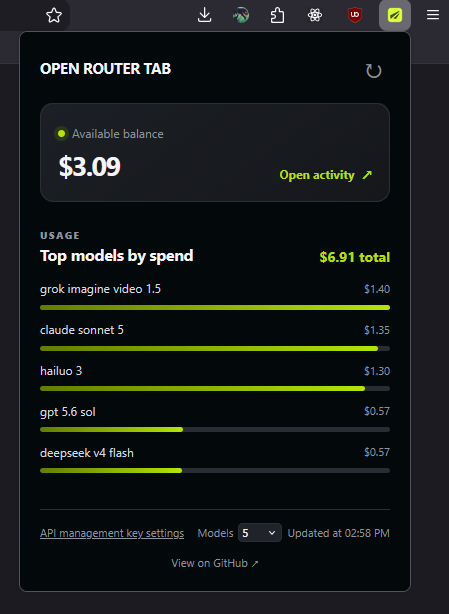

# OpenRouter tab

<p align="center">
  
</p>

Browser extension for a quick view of your OpenRouter profile, balance, and model usage.

Works in **Chrome** and **Firefox** (desktop 140+, Android 142+) from a single Manifest V3 package.

<p align="center">
  
</p>

## Usage

1. Open the extension popup or the options page.
2. Paste your OpenRouter **API management key** (`sk-or-v1-...`).
3. Save — the key stays in the extension’s local storage only.

Create a key at [openrouter.ai/keys](https://openrouter.ai/keys).

## Project layout

```
lib/
  constants.js    # shared constants
  browser.js      # shared browser API + async messaging
  settings.js     # storage defaults and helpers
  format.js       # money / model name formatting
  openrouter.js   # OpenRouter HTTP client
  dashboard.js    # balance + usage aggregation
background.js     # message router
popup.js          # popup UI
options/settings.js
manifest.json     # single MV3 manifest (Chrome + Firefox)
icons/            # PNG icons (16/32/48/128/512)
```

## Permissions

- `storage` — save API key and model list limit
- `https://openrouter.ai/api/*` — fetch key info, credits, and activity
